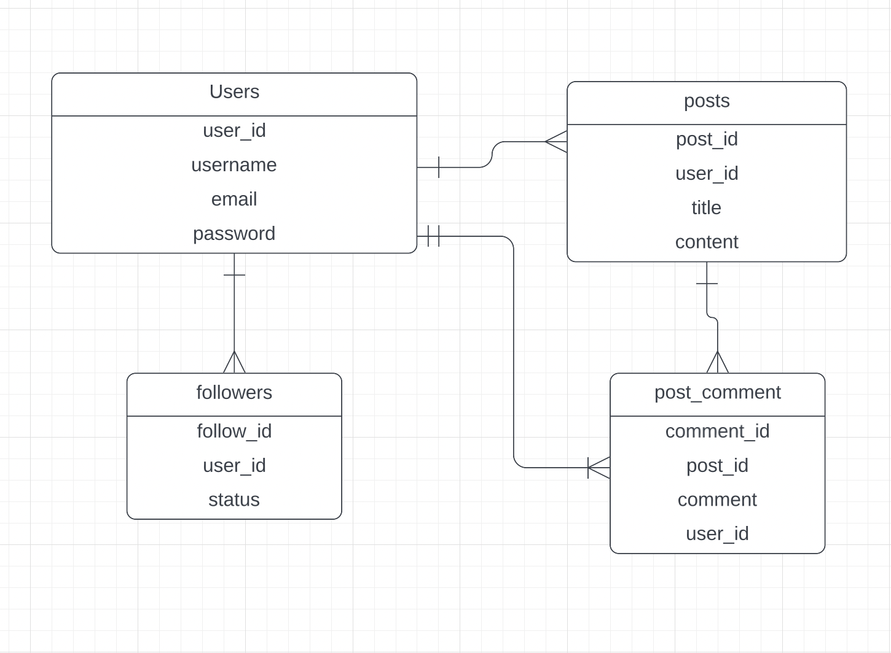

# Mounika Mokamatam
I'm Naga Mounika Mokamatam and I'm in my third semester of New Paltz CS Master’s Program. I received my bachelor’s degree in Electronics and Computer Science. During my undergrad, I took enough classes to have had a minor in Computer Science. I have taken several classes that cover the basics of java and basic to complex data structures, assembly language and computer architecture, database design, cloud computing, machine learning and data science topics, and cybersecurity. I am most familiar with C, java, python, R, Mathematics, and Professor Dos Reis’s assembly language.

• For this semester, I have registered for the course UI, I believe that I will be learning a lot of new concepts, and work with different technologies over the course time. Previously, I never got a chance to develop website on a whole and to integrate both frontend and backend. I consider taking this course as a great opportunity and I am very much excited to develop a website all by myself.

• The outcome of the courses which I have taken would help me building up some computer knowledge along with programming Knowledge which would help my work later.

# Erd Diagram

